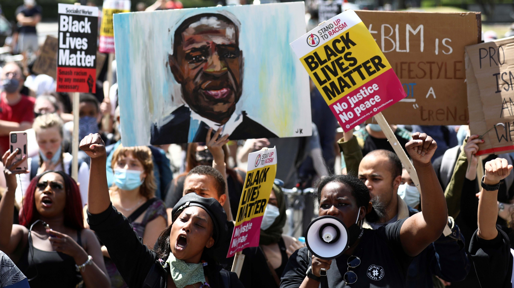
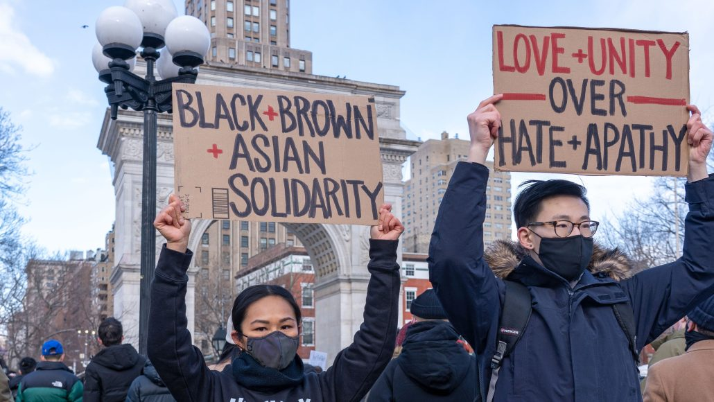

```{r setup, include=FALSE}
knitr::opts_chunk$set(echo = TRUE, fig.align="center")
#loading libraries
library(tidyverse)
library(DT)
library(mosaic)
library(foreign)
library(wordcloud)
library(textdata)
library(readr)
library(rtweet)
#loading datasets
#police shootings
acab <- read_csv("data/fatal-police-shootings-data.csv") %>%
  filter(date > "2019-12-31")
#hate crimes
hateCrimes <-  read_csv("data/table-1.csv") %>%
	janitor::clean_names() %>%
	select(bias_motivation, incidents)
#us population stats
pop <- read_csv("data/pop_stats.csv") %>%
	janitor::clean_names() %>%
	na.omit()
#wordcloud datasets
covid_exp <- read_csv("data/twitter_data/tweets_covid_exp.csv")
black_exp <- read_csv("data/twitter_data/tweets_black_exp.csv")
asian_exp <- read_csv("data/twitter_data/tweets_asian_exp.csv")
```

# Motivations
  
For our final project, we will not be building upon our mid-semester project, but instead looking at the social impacts of the pandemic specifically on Asian- and Black-American populations. Through our mid semester project we realized that the current available data surrounding vaccinations isn't all that great; however, we still wanted to focus on COVID and the sociopolitical effects of the pandemic which have a multitude of public health implications. Additionally, this past year has brought the prevalence of anti-Black and anti-Asian hate crimes and violence to the forefront of many American minds. This issue is not just a social one but greatly impacts health, and as of early April, [the CDC has declared racism](https://www.cdc.gov/media/releases/2021/s0408-racism-health.html) as a threat to public health.


# Research Questions
By analyzing both demographic, health, and social data (such as social media metrics), our group aims to explore how the past pandemic year has impacted both the mental and physical health of our chosen population. Our guiding questions are:

1. How has the pandemic impacted access to healthcare/social services?

2. How has the pandemic impacted mental health?

3. Have popular social movements such as [#StopAsianHate](https://twitter.com/search?q=%23StopAsianHate&src=typeahead_click) or [#BlackLivesMatter](https://twitter.com/search?q=%23StopAsianHate&src=typeahead_click) had an impact on health outcomes?

# Why focus on COVID-19

Our group wanted to focus on Black and Asian communities during the pandemic because these are the communities that hit closest to home for our research group. When the pandemic first started with the president of the United States calling the virus [the Chinese virus](https://www.ucsf.edu/news/2021/03/420081/trumps-chinese-virus-tweet-linked-rise-anti-asian-hashtags-twitter), the killings of [George Floyd](https://en.wikipedia.org/wiki/George_Floyd) and [Breonna Taylor](https://en.wikipedia.org/wiki/Killing_of_Breonna_Taylor) occurring in the summer of 2020, and the disproportionate deaths of people of color from [COVID-19](https://www.cdc.gov/coronavirus/2019-ncov/covid-data/investigations-discovery/hospitalization-death-by-race-ethnicity.html), we have personally perceived changes in our lived experiences as Black and Asian Americans. From our perspective, racism and bias has only seemed to increase during this pandemic despite growing awareness of the plights our communities face. We wanted to take a data based approach to see if our lived experiences and intuitions were reflected in publicly available national data. 

# Communities of Interest

While our communities of interest, Black and Asian America, are in no ways monolithic, there are data that we can focus on of these communities pre-COVID to get a better understanding of how the average experience has changed over the COVID-19 pandemic. 

## Black America

Police brutality against the Black community has come to the forefront of national conciousness over the past year with highly publicized murders by police such as the murder of George Floyd and Breonna Taylor. However, violence at the hands of the state is nothing new for this population. Black men and women are significantly more likely to be killed by police than their white counterparts [(Edwards et al 2019)](https://www.pnas.org/content/116/34/16793). Additionally, Black people disproportionately face hate crime and bias related incidents (see pie chart below). 
But the story Black America is not just one of plight. There is growing diversity within the Black population and an overall population increase. [Pew reports](https://www.pewresearch.org/social-trends/2021/03/25/the-growing-diversity-of-black-america/) that 1 in 4 Black people are members of generation Z, and there is a steady increase of Black people receiving college degrees.


## Asian America

The COVID-19 pandemic continues to spotlight the increase in anti-Asian bias and hate across the country. But, anti-Asian bias has been a crisis in this country for centuries. Laws such as the [Chinese Exclusion Act](https://history.state.gov/milestones/1866-1898/chinese-immigration) and [Japanese internment](https://www.archives.gov/education/lessons/japanese-relocation) codified anti-Asian sentiment. In April 2021, Pew Research reported that [1 in 3 Asian Americans fear race based physical violence](https://www.pewresearch.org/fact-tank/2021/04/21/one-third-of-asian-americans-fear-threats-physical-attacks-and-most-say-violence-against-them-is-rising/). 
But like Black-America, the narrative is not only negative. Asian-Americans are the fastest growing racial group in America, and they are more likely to have a college degree than the average American. Overall, Asian-Americans have lower poverty rates than the national average, but withingroup differences are large, and smaller impoverished Asian ethnic groups are often overlooked  [(Pew 2021)](https://www.pewresearch.org/fact-tank/2021/04/09/asian-americans-are-the-fastest-growing-racial-or-ethnic-group-in-the-u-s/). 

## What the data tells us

Our visualizations show that the proportion of hate crimes faced by marginalized ethnic groups is frequently not proportionate to their percentage of the overall population. By looking at data pre-COVID/2020, we can see that disproportionate anti-asian and anti-Black violence is not new in this country. The shiny app spatial visualizations show us that pre-pandemic there were widespread racial health inequities in the US with disparities in our communities of interest when compared to the overall population: including higher rates of poor mental health, poor physical health.
These visualizations motivated our desire to explore further about which ways these data might have changed as national hate crime statistics are not yet publicly available for 2020, and we get a glimpse into current health inequities with the final visualization that geographically displays the distribution of COVID-19 deaths my racial group.   

### Pie Charts

```{r echo=FALSE, warning=FALSE, message=FALSE}
#hate crimes bar chart
g <- hateCrimes %>%
	ggplot(aes(x="", y=incidents, fill=bias_motivation))
g + geom_bar(stat="identity", width=1) +
  coord_polar("y", start=0) +
	theme_void() +
	labs(x= "Bias Motivation",
			 y= "Number of Incidents",
			 title = "Number of bias related incidents",
			 subtitle = "in 2019",
			 fill= NULL)
#population pie chart
g3 <- pop %>%
	ggplot(aes(x="", y=united_states, fill=fact))
g3 + geom_bar(stat="identity", width=1) +
  coord_polar("y", start=0) +
	theme_void() +
	labs(title= "Percentage of US racial groups",
			 subtitle = "from 2020 census",
			 fill="Racial group")
```

### Shiny App 

Check out some of our spatial visualizations [here](https://lewis-ayodele.shinyapps.io/BlogAL/)

# Twitter Analytics

## Rise of Social Media during the Pandemic



A pandemic, the death of George Floyd, the rise of hate crimes, and a presidential election called Americans to action. These events aggregated into a surging movement of activism that called for social change. The pandemic added a level of complexity (i.e., lockdowns and movement restrictions) that ultimately resulted in many of these calls to action to take place online. 

The past 15 months proved that social media can be an agent of change beyond advertisements and awareness. We all witnessed the riveting rise of digital activism nationwide during a pandemic. The pandemic put people in a space where there was no other distraction and conveniently social media was accessible at the tip of our fingers, leaving room to amplify a lot of things that were usually silenced. Activism and protest thrived in digital spaces like Tiktok and Twitter. Simply, users felt that they have a safe space to interact, feel connected, be comforted, distract themselves, stay engaged, and find inspiration - without any risk of contagion.

To better understand what it means to be Black or Asian in America during a pandemic, we decided to turn to Twitter.

## Why Twitter

Twitter defines its platform as "what's happening and what people are talking about right now," and they do so by "serving the public conversation." Twitter is among the top 3 social networking apps in the US with 353.1 million monthly and 192 million daily active users currently (February 2021). Twitter generates vast amounts of user-generated language data, making it the perfect platform to conduct textual/sentiment analysis. Twitter has considerable advantages over other social media platforms (e.g., Instagram, Facebook, TikTok) for analysis: 

1) Every tweet is limited to a maximum of 280 characters, which provides us with a relatively homogeneous corpora.

2) The entry costs are low - it's free to make an account! There are millions of active users that post tweets and retweet/favorite/comment on organic tweets, which generates an accessible and large data sample. 

3) The tweets are publicly available, accessible, and retrievable via APIs. 

### Twitter API


Twitter API (application programming interfaces) enables programmatic access to Twitter. It can be used to analyze, gain insight from, and interact with Tweets/replies, accounts/users, direct messages, ads, and other endpoints. 

To access it, users must register an application and permissions are not granted by default as there is an application follow-up that requires additional permissions. The standard Twitter API is free of charge and offers a seven-day endpoint to the tweet searches made. In order to trace back farther than seven-day old tweets, a paid subscription for the Premium or Enterprise subscription package is necessary.


## Word Clouds 

```{r read-in monogram data, echo=FALSE, warning=FALSE, message=FALSE}
covid_monograms <- read_csv("data/twitter_data/tweets_covid_monograms.csv")
asian_monograms <- read_csv("data/twitter_data/tweets_asian_monograms.csv")
black_monograms <- read_csv("data/twitter_data/tweets_black_monograms.csv")
```

### Tweets related to generally about COVID 
```{r wordclouds, echo=FALSE, warning=FALSE, message=FALSE}
set.seed(1234)

# Show the most frequent words associated with the pandemic 
wordcloud(covid_monograms$word, min.freq=10, max.words = 100, scale=c(2, .5), 
          random.order=FALSE, rot.per=0.25, colors=brewer.pal(15, "Dark2"))
```

### Tweets related to Asian American trends

```{r, echo=FALSE, warning=FALSE, message=FALSE}
set.seed(1234)
# Show the most frequent words associated with the Asian American experience 
wordcloud(asian_monograms$word, min.freq=10, max.words = 100, scale=c(2, .5), 
          random.order=FALSE, rot.per=0.25, colors=brewer.pal(15, "Dark2"))
```

### Tweets related to Black American trends 

```{r, echo=FALSE, warning=FALSE, message=FALSE}
set.seed(1234)
# Show the most frequent words associated with the Black experience 
wordcloud(black_monograms$word, min.freq=5, max.words = 50, scale=c(2, .5), 
          random.order=FALSE, rot.per=0.25, colors=brewer.pal(15, "Dark2"))
```

### Quantification via Bar Chart Frequencies

```{r bar charts, echo=FALSE, warning=FALSE, message=FALSE}
# gives you a bar chart of the most frequent words found in the tweets
covid_bar <- covid_monograms %>% 
  count(word, sort = TRUE) %>%
  top_n(30) %>%
  mutate(word = reorder(word, n)) %>%
  ggplot(aes(x = word, y = n)) +
  geom_col(fill = "blue") +
  xlab(NULL) +
  coord_flip() +
  labs(y = "\n Count", x = "Unique words", title = "Pandemic") + 
  theme_minimal() + 
  theme(axis.text.x = element_text(angle = 60, vjust = 0.5, hjust=1))

asian_bar <- asian_monograms %>% 
  count(word, sort = TRUE) %>%
  top_n(30) %>%
  mutate(word = reorder(word, n)) %>%
  ggplot(aes(x = word, y = n)) +
  geom_col(fill = "purple") +
  xlab(NULL) +
  coord_flip() +
  labs(y = "\n Count", x = "Unique words", title = "Being Asian") + 
  theme_minimal() + 
  theme(axis.text.x = element_text(angle = 60, vjust = 0.5, hjust=1))

black_bar <- black_monograms %>% 
  count(word, sort = TRUE) %>%
  top_n(30) %>%
  mutate(word = reorder(word, n)) %>%
  ggplot(aes(x = word, y = n)) +
  geom_col(fill = "darkgreen") +
  xlab(NULL) +
  coord_flip() +
  labs(y = "\n Count", x = "Unique words", title = "Being Black") + 
  theme_minimal() + 
  theme(axis.text.x = element_text(angle = 60, vjust = 0.5, hjust=1)) 

gridExtra::grid.arrange(covid_bar, asian_bar, black_bar, ncol=3)
```

A few interesting observations: 

- The word "availability" is the most frequently used word in the pandemic category. Given the Twitter data was pulled from first and second week of May 2021, it makes sense since the country is going through mass vaccine distribution efforts.

- Words related to the criminal justice system (e.g., "police", "justice", "officers") appeared in top 30 of the "Being Black" category. This tells us how the black experience during the pandemic has not only been about combating health issues but also fighting against institutionalized racism, police brutality, medical bias, and so much more. The current civil unrest is deeply connected to the racial disparities that have been brutally exposed by the coronavirus crisis. This textual data finding supports American Psychological Association (APA) President Sandra L. Shullman's comment that "we are living in a [racism pandemic](https://www.apa.org/news/press/releases/2020/05/racism-pandemic)." For Blacks, they are going through a pandemic on a pandemic.  

- The word "im" is part of the top 20 in all three categories. It tells us that many users are tweeting about their *personal* experiences or opinions on the pandemic and issues/current events related to anti-Asian and anti-Black racism. Racially charged, disturbing, and upsetting incidents have startlingly increased in the past year during the pandemic. Twitter users have taken advantage of Twitter's platform to vocalize about these incidences, processing their experiences instantaneously and packing life into 280-character tweets as they lived it. The fun of Twitter is its opportunity for self-expression: thoughts are externalized, and feelings are reflected upon.

- In "Being Asian" category, "black" appeared in the top 30. Conversely, in the "Being Black" category", "stopasianhate" appeared in the top 30. This shows that the racism is long-lasting, pervasively prominent, and institutionalized in the US. It shows how communities of POC's (people of color) come together to form the Black-Asian solidarity and aims to stand against and ultimately dismantle white supremacy. This finding supports the rise in support towards and participation in the fight for the liberties of all marginalized groups. A Chinese American New York-based fashion designer Dao-Yi Chow, who was one of the organizers of Running to Protest’s “Black & Asian Solidarity” rally, remarks on this [shift occurring in AAPI community](https://time.com/5949926/black-asian-solidarity-white-supremacy/) towards Black-Asian unity. "We have new generations of young people and activities... who are down and will show up for the Black and brown struggle, who will continue to fight for the greater social justice movement not only when we're under attack but when everyone is under attack. 



## Bigram Analysis 

```{r read-in bigram data, echo=FALSE, warning=FALSE, message=FALSE}
covid_bigrams <- read_csv("data/twitter_data/tweets_covid_bigrams.csv")
asian_bigrams <- read_csv("data/twitter_data/tweets_asian_bigrams.csv")
black_bigrams <- read_csv("data/twitter_data/tweets_black_bigrams.csv")
```

```{r bar charts 2, echo=FALSE, warning=FALSE, message=FALSE}
#creating bigrams for COVID data
covid_bigrams %>% 
  top_n(15) %>%
  mutate(bigram = reorder(bigram, n)) %>%
  ggplot(aes(x = bigram, y = n)) +
  geom_col(fill = "blue") +
  xlab(NULL) +
  coord_flip() +
  labs(y = "\n Count", x = "Unique Bigrams", title = "Pandemic") + 
  theme_minimal() + 
  theme(axis.text.x = element_text(angle = 60, vjust = 0.5, hjust=1))
#creating bigrams for Asian data
asian_bigrams %>% 
  top_n(15) %>%
  mutate(bigram = reorder(bigram, n)) %>%
  ggplot(aes(x = bigram, y = n)) +
  geom_col(fill = "purple") +
  xlab(NULL) +
  coord_flip() +
  labs(y = "\n Count", x = "Unique Bigrams", title = "Being Asian") + 
  theme_minimal() + 
  theme(axis.text.x = element_text(angle = 60, vjust = 0.5, hjust=1))
#creating bigrams for Black data
black_bigrams %>% 
  top_n(15) %>%
  mutate(bigram = reorder(bigram, n)) %>%
  ggplot(aes(x = bigram, y = n)) +
  geom_col(fill = "darkgreen") +
  xlab(NULL) +
  coord_flip() +
  labs(y = "\n Count", x = "Unique Bigrams", title = "Being Black") + 
  theme_minimal() + 
  theme(axis.text.x = element_text(angle = 60, vjust = 0.5, hjust=1)) 
```

A few notable observations: 

- The bigram "sore arm" appears as one of the top 15 for the "Pandemic" category. According to the CDC, [sore arm](https://www.cdc.gov/coronavirus/2019-ncov/vaccines/expect/after.html) or muscle pain is one of the possible side effects after getting the COVID-19 vaccine. Given that the country is currently mass distributing vaccines, it makes sense that Twitter users have been tweeting about muscle soreness. 

- Unsurprisingly and most unfortunately, the bigram "hate crimes" appears as one of the top 15 for the "Being Asian" category. [A new study](https://www.cnn.com/2021/05/05/us/anti-asian-hate-crimes-study/index.html) by the Center for the Study of Hate and Extremism at California State University, San Bernardino, finds that reported hate crimes against Asians in 16 of the US largest cities/counties are up 164% since this time last year. Our findings from the digital space of Twitter reflect this trend of incidences happening in the country. 

- The bigram "ding ding" is the most frequent bigram for the "Being Black" category. We tracked down the account [OldMainBell](https://twitter.com/OldMainBell) that has been mass-tweeting the word "ding" alongside the #BlackLivesMatter hashtag. We are puzzled by these tweets and hope to reach out to Penn State to understand the inside joke. 

# Mental Health

We also studied the emotional impact that COVID-19 MAY have inflicted upon individuals in the United States, based racial group. We say MAY, mostly because despite the fact that we obtained our data during the “peak” months of the COVID-19 pandemic, there are many other variables/factors that we did not consider that also could have contributed to the emotional toil upon these individuals: economic issues, familial problems, and personal distraught.  

To best apply our analysis to this general issue, we created a Shiny application that enabled us to view diverse relationships between racial groups and the percentage of individuals who have succumbed to depression and/or anxiety. To visualize these relationships, we created an interactive time series line graph and an interactive bar chart.

To provide some clarification on a certain variable, “Time Period” represents the time period in which data was collected. We made sure to collect data from time periods that corresponded to the timeline of the COVID-19 pandemic in the United States. To define all 28 time periods:

- Time Period 1 = April 23, 2020 - May 5, 2020
- Time Period 2 = May 7 - May 12
- Time Period 3 = May 14 - May 19
- Time Period 4 = May 21 - May 26
- Time Period 5 = May 28 - June 2
- Time Period 6 = June 4 - June 9
- Time Period 7 = June 11 - June 16
- Time Period 8 = June 18 - June 23
- Time Period 9 = June 25 - June 30
- Time Period 10 = July 2 - July 7
- Time Period 11 = July 9 - July 14
- Time Period 12 = July 16 - July 21
- Time Period 13 = August 19 - August 31
- Time Period 14 = September 2 - September 14
- Time Period 15 = September 16 - September 28
- Time Period 16 = September 30 - October 12
- Time Period 17 = October 14 - October 26
- Time Period 18 = October 28 - November 9
- Time Period 19 = November 11 - November 23
- Time Period 20 = November 25 - December 7
- Time Period 21 = December 9 - December 21
- Time Period 22 = January 6, 2021 - January 18, 2021
- Time Period 23 = January 20 - February 1
- Time Period 24 = February 3 - February 15
- Time Period 25 = February 17 - March 1
- Time Period 26 = March 3 - March 15
- Time Period 27 = March 17 - March 29
- Time Period 28 = April 14 - April 26

As we noticed, the CDC left some gaps, most likely due to lack of data to contribute.

When looking at the time series line graph, we noticed peculiar patterns that we deemed were too difficult to tell if they were related to the COVID-19 pandemic.  Some general ideas we took away from this interactive graph, however, included:

- A higher percentage of Hispanic/Latino individuals seemed to be depressed/anxious as we approach present day.

- The percentage of White individuals who reported that they were depressed/anxious seemed to rise and dip according to certain time periods. These rises and dips could be an effect of practically anything. 

- A higher percentage of Black individuals seemed to be depressed/anxious as we approach present day until we reach Time Period 25. After Time Period 25, we see a huge dip in percentage of Black individuals who reported to be depressed/anxious. Though we are not too sure on what caused this dip, some events that took place during this time included Trump’s second impeachment trial and COVID-19 entering an optimistic rollout stage.

- The percentage of Asians who seemed depressed/anxious seemed to be low in general, despite a spike during Time Period 12. After some gathering of information, we also concluded that this was the time former President Trump used the words “kung flu” to describe the COVID-19 virus.  Coincidence?  We think not.

When looking at the bar chart, there does not seem to be any correlation between Time Period and percentage of individuals who reported to be depressed or anxious. We’ve concluded that though the pandemic has certainly affected people emotionally and (unfortunately) for the worse, there are many other factors that we did not take into consideration during our analysis. There does not seem to be any other conclusive relationships that we have noticed between racial group and Time Period as well. Different racial groups had different percentages of those depressed at different time periods, which proved to be normal and not surprising at all.

Therefore, though the COVID-19 pandemic has certainly affected people emotionally due to its rapid rampage and huge impact physically upon everyone in the United States, we cannot attribute most cases of depression to the pandemic specifically.

[Click here](https://lewis-ayodele.shinyapps.io/MentalHealthBK/) to see our interactive visualizations!

# Limitations

It is important to note that it is hard to come by strong demographic data for asian populations in the US because many national surveys, such as the surveys conducted by Pew Research center, are not conducted in Asian languages, therefore there is a strong non-response bias in our data.

In terms of the Twitter data, we were only able to access the standard API package. This means that we were only able to pull tweets from up to seven days ago. Our initial hope was to do in-depth Twitter analysis on the trends over time since the start of the pandemic, looking at specific key events that happened over the course of the past 15 months (e.g., killing of George Floyd, killing of Breonna Taylor, President Trump calls COVID-19 the “Chinese virus”, distribution of vaccines) and comparing it to what was happening on Twitter. Unfortunately, we were only able to pull our data from early May 2021 and consequently give a specific and narrow snapshot of Twitter during the pandemic. 

In assessing mental health during the COVID-19 pandemic, we ran into some limitations that proved to hinder us. For one thing, while data scraping proved to be relatively easy due to our source being the CDC, we realized that there were some large gaps between time periods.  For example, the latest date of Time Period 21 (December 21, 2020) was about 2 weeks and a half away from the earliest date of Time Period 22 (January 6, 2021). Therefore, these gaps are definitely confounding variables that affected the results shown through our line graph and bar chart.  Another limitation is obviously nonresponse bias, in that the results displayed in our data graphics may be skewed due to underrepresentation of the reality of those affected by depression and anxiety.  Many people may be uncomfortable sharing their intimate experiences, and so we must take into consideration that there may be more individuals who were depressed/anxious than we think during the official time periods.

# Future Directions

In terms of the Twitter analysis, we hope to routinely collect more data as the pandemic progresses to gain a more holistic understanding of the digital space during the pandemic. Another option is to purchase the Premium or Enterprise subscription package to increase the functionality and gain access to the past 30 days of Twitter data or to the full history of Twitter data dependent on the endpoint selected. Once we have more complete data for the question we hope to address, we will conduct in-depth sentimental analysis to examine the trends in public opinion changes over time (e.g., more happiness and joy when vaccines were first approved, fear and sadness when racially charged hate crimes occurred). 

To reiterate, the data about mental health was based upon an experimental data system called the [Household Pulse Survey](https://www.census.gov/programs-surveys/household-pulse-survey/data.html). According to the CDCs, this “20-minute online survey was designed to complement the ability of the federal statistical system to rapidly respond and provide relevant information about the impact of the coronavirus pandemic in the U.S.” In terms of its utilization, we believe that this system was really beneficial in allowing us to conduct the necessary research and analysis that we conveyed through this blog.  We hope that a system such as this one could be used to measure not only anxiety and depression during the coronavirus pandemic in general, but also anxiety and depression during social and political movements. We hope that, though statistics do not reveal the entire story, these types of systems can enable us to view individuals’ emotions and experiences with a higher level of sophistication.  
